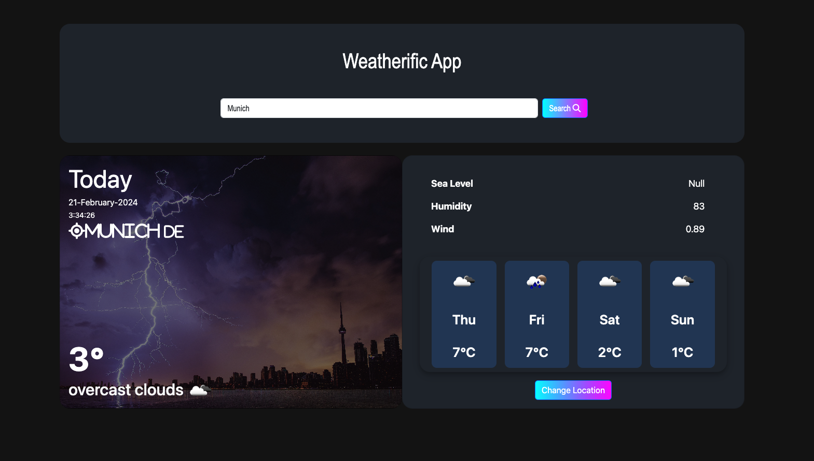

# Weatherific

## Description
Weatherific is a Vue.js application that allows users to search for weather information country-wise using the OpenWeatherMap free weather API. Before running this application, make sure to obtain a free API key from OpenWeatherMap and set it as the `apiKey`.

## Features
- Search for weather information by country.
- Display current weather conditions including temperature, humidity, wind speed, etc.
- Responsive design for various devices.

## Screenshots

## Getting Started
1. Clone this repository.
2. Obtain a free API key from [OpenWeatherMap](https://openweathermap.org/api) and set it as the value for `apiKey` in `src/config.js`.
3. Install dependencies using `npm install`.
4. Run the application using `npm run serve`.
5. Open your browser and navigate to `http://localhost:8080`.

## Usage
- Enter the name of the country in the search bar and press enter.
- View the weather information for the specified country.

## Technologies Used
- Vue.js
- OpenWeatherMap API

## Credits
- This project utilizes the [Vue.js](https://vuejs.org/) framework.
- Weather data is provided by the [OpenWeatherMap API](https://openweathermap.org/api).

## License
This project is licensed under the MIT License - see the [LICENSE](LICENSE) file for details.
